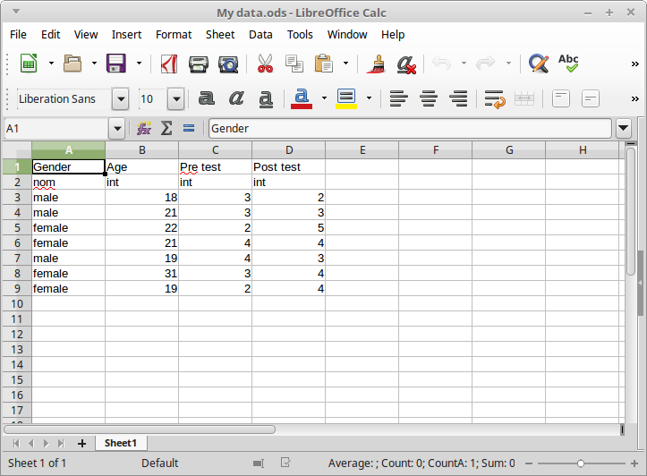
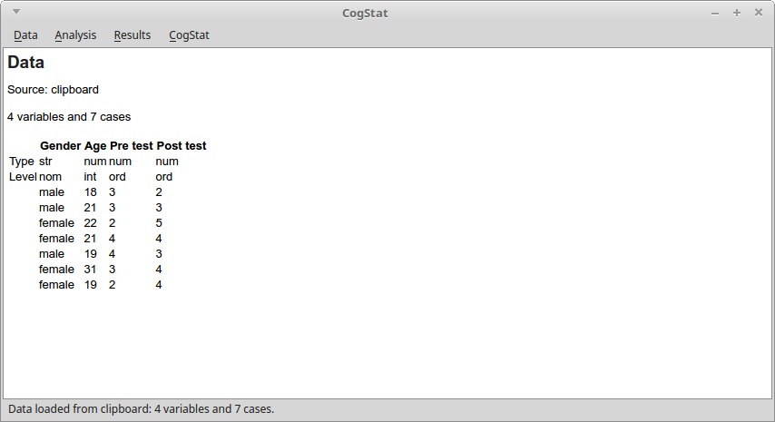
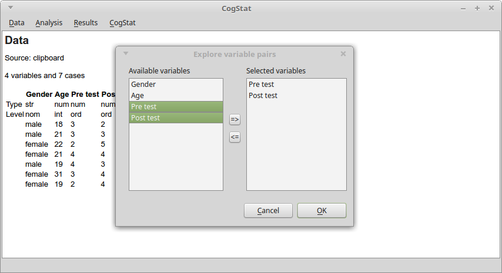
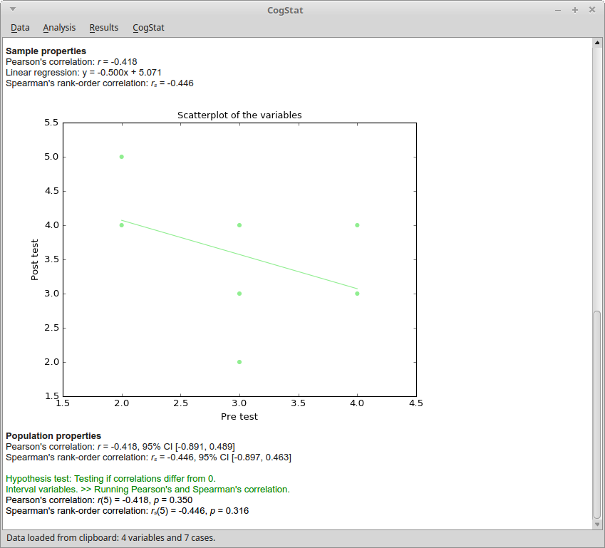

# [Download and install CogStat](Installation)

[Download](https://www.cogstat.org/download.html) and install CogStat with a few clicks.

If needed, find more information about the installation [here](Installation).

# [Open data](Handling-data)

### Use demo data

If you want to test CogStat quickly without using your data, you can use the [demo data](Demo-data) which includes datasets of other textbooks or software packages. From the `Data > Open demo data file...` menu, choose a folder and a data file, then click the `Open` button. (Note that some of the data files that are provided by other sources cannot be opened because they are not regular data files. In that case, choose another data file.)

### Use your data

* Unlike most statistical software, CogStat will not handle your data editing tasks, because there are more efficient solutions for that. You can use either spreadsheet software (such as Excel, Google Spreadsheet, or LibreOffice Calc) or various other statistical software packages (such as jamovi, JASP, SPSS, STATA, SAS) to store your data. See the list of supported file formats 
[here](Handling-data#available-file-formats).

* CogStat analyses your data automatically, and for deciding what to calculate, CogStat must know what the measurement levels of your variables are. Therefore, unlike in other software packages, it is essential to set the measurement level of your variables. If you don't set the measurement levels, CogStat will assume that variables including text are nominal and numerical variables are interval data.

**Option 1: Use statistical software to store your data**
* You can use your previous data files created in other software packages, and you can continue using that package for editing your data.
* It is essential to set the measurement levels of your variables before importing them to CogStat, otherwise CogStat may handle them incorrectly. Some statistical software packages cannot set the measurement levels or they cannot save them. Find more information about the preferred file formats [here](Handling-data#available-file-formats).
* After saving your data in the other statistical package, open the data simply by using the `Data > Open data file...` menu or by dragging and dropping the file to the CogStat window.

**Option 2: Use a spreadsheet editor for handling your data.**

* Use LibreOffice Calc, Microsoft Excel, Google Spreadsheet, or other spreadsheet software to handle your data. First, it may seem unusual to use another software for data handling, but spreadsheet software packages are powerful tools to handle data and to check some simple statistics as well - and they are much more powerful than the data editor features of the statistical software packages.
* Add names and measurement levels to your data:
    * In your data, the first row should include the variable names (preferably use only the English alphabet).
    * Unlike in most statistical software packages, in CogStat you should set the [measurement level](https://en.wikipedia.org/wiki/Level_of_measurement#Stevens's_typology) of your variables. This is essential because CogStat will automatically choose the most appropriate analyses partly based on this information. If you set the measurement level incorrectly, CogStat might give you inaccurate or improper results. So, the second row should include the [measurement level](https://en.wikipedia.org/wiki/Level_of_measurement#Stevens's_typology) of those variables: `int`, `ord` or `nom` for interval (or ratio), ordinal and nominal variables.
    * The rest of the lines should include the values of the variables.

* Finally, import your data. The simplest way to bring your data to CogStat is to copy and paste it: select your data in the spreadsheet software, copy it, and paste it to CogStat. Another way is to save your data from your spreadsheet software, and open it in CogStat (or drag and drop the spreadsheet file to the CogStat window).

# Analyze data

**Run an analysis.** In the [Analysis menu](Documentation-for-users#using-cogstat), you find all the available analysis possibilities. Choose the task from the menu (note that you’ll not see specific test names, chart names, and the like in the menu, but only some tasks), then choose the appropriate variables, and in some rare cases set some options, and you’re good to go. All other works will be done by CogStat.

**Check the results.** The results are compiled automatically by CogStat. These analyses include a lot of tweaks to have more meaningful, intuitive, and informative results. For example, most analyses include the [raw data, sample properties, and population properties sections](Common-elements-of-the-analysis-results#raw-data-sample-properties-and-population-properties), with which it is much easier to review and interpret your results. As another example, the [chart axes reflect the measurement level](Common-elements-of-the-analysis-results#axes-of-the-charts) of that variable. See the [help pages of the analyses](Documentation-for-users#using-cogstat) to find the detailed description of what is displayed and why.

**Changing the analyses to run.** CogStat will automatically choose the appropriate analyses, charts, parameters, etc. What to do if you’d want to change it?
* One option to consider is not to change the analyses. Flexibility in data analysis is one of the reasons why results in the literature may be unreliable (even if the researchers do not realize that flexibility in the data analysis will lead to lower quality results). One solution is to follow standardized/recommended analysis pipelines, such as the one that is implemented in CogStat.
* No automatic data analysis software can be complete in the sense that there could always be cases that are not considered by the algorithm, or there could be new methodological/statistical recommendations that are not implemented yet. In those cases, we recommend the use of classic individual analysis software packages.
    * If you think that new details should be considered in the analysis, [recommend a new feature](Suggest-a-new-feature) for CogStat, so we may consider implementing it.
    * If you think that CogStat calculated the results incorrectly, you can [report a bug](Report-a-bug).

**[Storing the result.](Handling-output)** You can save the output from the Result menu in pdf format. However, there's a chance that you don’t even need to save your result, but it may be faster to rerun the analysis than to look for the saved pdf file and to look for the relevant part in the output (note again, that, in CogStat, most analyses need only a few clicks).
